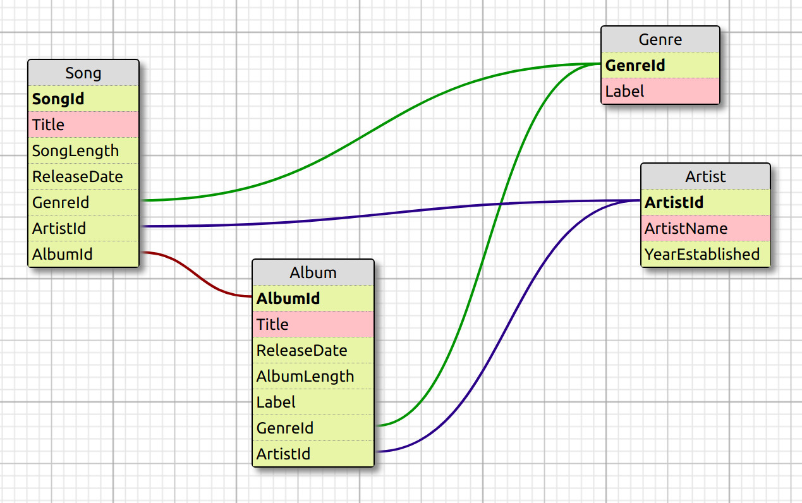

## Relational databases  

1. Create an ERD for the Music History databse
1. Open in your Database Browser
1. Use one of the tools listed above to create an ERD

### Attempt 1 with Ondras SQL Designer

[Source code](10-music-history-erd.xml)

### Attempt 2 with LucidChart

[PDF](erd2.pdf)